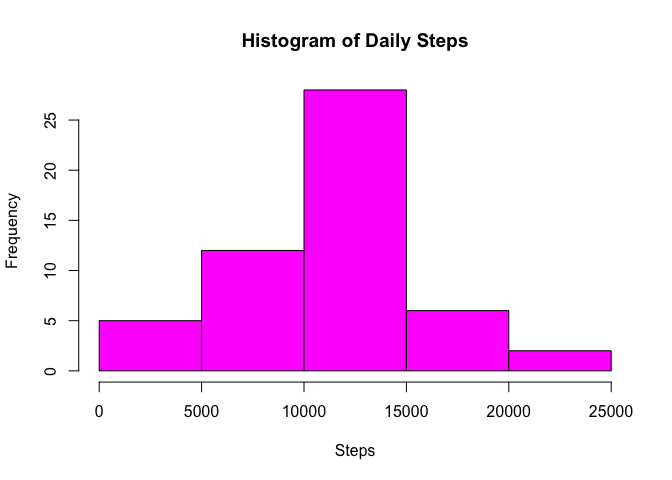

# Reproducible Research: Peer Assessment 1
## Load required packages, then load the data

```r
library(dplyr)
```

```
## 
## Attaching package: 'dplyr'
## 
## The following objects are masked from 'package:stats':
## 
##     filter, lag
## 
## The following objects are masked from 'package:base':
## 
##     intersect, setdiff, setequal, union
```

```r
library(lattice) 
activity<-read.csv(file = "activity.csv" )
```

##Calculating the total number of steps per day and plotting the histogram and outputting mean and median.
What is mean total number of steps taken per day?

```r
stepday<-aggregate(activity$steps, list(activity$date), sum)
stepday<-as.data.frame(stepday)
colnames(stepday)<-c("Day", "Total_Steps")
print(stepday)
```

```
##           Day Total_Steps
## 1  2012-10-01          NA
## 2  2012-10-02         126
## 3  2012-10-03       11352
## 4  2012-10-04       12116
## 5  2012-10-05       13294
## 6  2012-10-06       15420
## 7  2012-10-07       11015
## 8  2012-10-08          NA
## 9  2012-10-09       12811
## 10 2012-10-10        9900
## 11 2012-10-11       10304
## 12 2012-10-12       17382
## 13 2012-10-13       12426
## 14 2012-10-14       15098
## 15 2012-10-15       10139
## 16 2012-10-16       15084
## 17 2012-10-17       13452
## 18 2012-10-18       10056
## 19 2012-10-19       11829
## 20 2012-10-20       10395
## 21 2012-10-21        8821
## 22 2012-10-22       13460
## 23 2012-10-23        8918
## 24 2012-10-24        8355
## 25 2012-10-25        2492
## 26 2012-10-26        6778
## 27 2012-10-27       10119
## 28 2012-10-28       11458
## 29 2012-10-29        5018
## 30 2012-10-30        9819
## 31 2012-10-31       15414
## 32 2012-11-01          NA
## 33 2012-11-02       10600
## 34 2012-11-03       10571
## 35 2012-11-04          NA
## 36 2012-11-05       10439
## 37 2012-11-06        8334
## 38 2012-11-07       12883
## 39 2012-11-08        3219
## 40 2012-11-09          NA
## 41 2012-11-10          NA
## 42 2012-11-11       12608
## 43 2012-11-12       10765
## 44 2012-11-13        7336
## 45 2012-11-14          NA
## 46 2012-11-15          41
## 47 2012-11-16        5441
## 48 2012-11-17       14339
## 49 2012-11-18       15110
## 50 2012-11-19        8841
## 51 2012-11-20        4472
## 52 2012-11-21       12787
## 53 2012-11-22       20427
## 54 2012-11-23       21194
## 55 2012-11-24       14478
## 56 2012-11-25       11834
## 57 2012-11-26       11162
## 58 2012-11-27       13646
## 59 2012-11-28       10183
## 60 2012-11-29        7047
## 61 2012-11-30          NA
```

```r
hist(stepday$Total_Steps, main="Histogram of Daily Steps", col="magenta", xlab="Steps")
```

 

```r
mean(stepday$Total_Steps, na.rm=TRUE)
```

```
## [1] 10766.19
```

```r
median(stepday$Total_Steps, na.rm=TRUE)
```

```
## [1] 10765
```

## What is the average daily activity pattern?

```r
byinterval<-aggregate(activity$steps, list(activity$interval), mean, na.rm=TRUE)
colnames(byinterval)<-c("Interval", "Mean_Steps")
plot(byinterval,type="l", main="Time Series of Average Steps by Interval",      ylab="steps", xlab="Interval")
```

 

```r
byinterval[which.max(byinterval$Mean_Steps), "Interval"]
```

```
## [1] 835
```


## Imputing missing values, using the mean steps at that time interval. Using looping in merge function. 

```r
merger<-merge(activity,byinterval, by.x="interval", by.y="Interval", all.x = TRUE)
merger[is.na(merger$steps)!=FALSE,"steps"]<-merger[is.na(merger$steps), "Mean_Steps"]
newdata<-select(merger, steps, date, interval)
newdata.total<-aggregate(newdata$steps, by = list(newdata$date), FUN = sum)
colnames(newdata.total)<-c("Day", "Total_Steps")
hist(stepday$Total_Steps, main="Histogram of Daily Steps", col="green", xlab="Steps")
```

 

```r
mean(newdata.total$Total_Steps, na.rm = TRUE)
```

```
## [1] 10766.19
```

```r
median(newdata.total$Total_Steps, na.rm = TRUE)
```

```
## [1] 10766.19
```
So there doesn't appear to be much change in the mean or median after interpolating the NA values

## Are there differences in activity patterns between weekdays and weekends?

```r
newdata$Day<-as.Date(newdata$date, "%Y-%m-%d")
newdata$weekday<-weekdays(newdata$Day)
weekends<-filter(newdata, weekday=="Saturday"|weekday=="Sunday")
weekends$weekend<-"Weekend"
weekdays<-filter(newdata, weekday!="Saturday"& weekday!="Sunday")
weekdays$weekend<-"Weekday"
newdata2<-arrange(rbind(weekends,weekdays), Day)
newdata2total<-aggregate(newdata2$steps, list(newdata2$interval, newdata2$weekend), mean)
colnames(newdata2total)<-c("Interval","Weekend", "Mean_Steps")
attach(newdata2total)
xyplot(Mean_Steps ~ Interval | Weekend, type= "l", main="Average Steps during weekends and weekdays")
```

 

